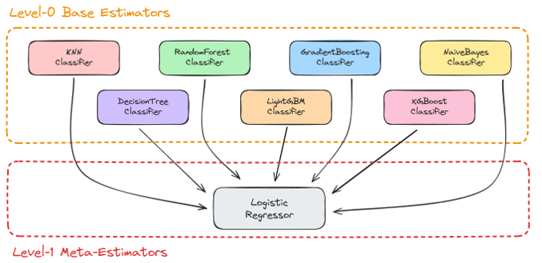
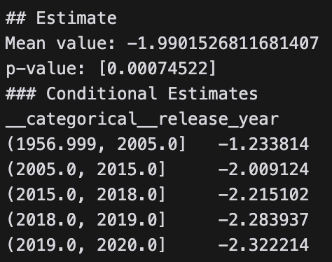
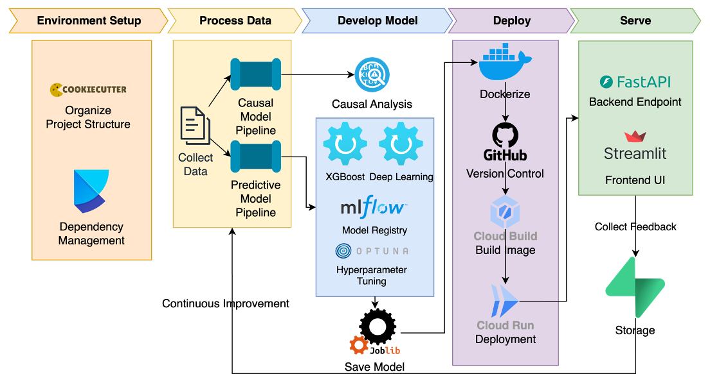

Spotify-Music
==============================

## Team Members

### Part 1
- Arnav Gupta
- Freddy Chen
- Jatin Suri
- Lakshya Agarwal
- Om Sangwan
- Yiyi Yang

### Part 2
- Om Sangwan
- Yiyi Yang
- David Gao
- Emily Wu
- Yifan Lu

## Data Source

The dataset we are using is the [Spotify - 30000 songs](https://www.kaggle.com/datasets/joebeachcapital/30000-spotify-songs).

## Project Description

We aim to uncover patterns and relationships that drive song popularity to empower artists and producers with the knowledge to make smarter, evidence-based decisions. We will be using the Spotify dataset to analyze the features of songs and their popularity. We aim to build two models:

- Predictive Model for Song Popularity
- Causal Model for Song's Duration Effect on its Popularity

## Model 1: Predictive Model for Song Popularity



## Model 2: Causal Model for Song's Duration Effect on Song's Popularity



The results show a statistically significant negative causal relationship between the duration of a song and its popularity that increases with time.

Project Architecture
--------


Project Organization
------------

    ├── LICENSE
    ├── Makefile           <- Makefile with commands like `make data` or `make train`
    ├── README.md          <- The top-level README for developers using this project.
    ├── data
    │   ├── external       <- Data from third party sources.
    │   ├── interim        <- Intermediate data that has been transformed.
    │   ├── processed      <- The final, canonical data sets for modeling.
    │   └── raw            <- The original, immutable data dump.
    │
    ├── docs               <- A default Sphinx project; see sphinx-doc.org for details
    │
    ├── models             <- Trained and serialized models, model predictions, or model summaries
    │
    ├── notebooks          <- Jupyter notebooks. Naming convention is a number (for ordering),
    │                         the creator's initials, and a short `-` delimited description, e.g.
    │                         `1.0-jqp-initial-data-exploration`.
    │
    ├── references         <- Data dictionaries, manuals, and all other explanatory materials.
    │
    ├── reports            <- Generated analysis as HTML, PDF, LaTeX, etc.
    │   └── figures        <- Generated graphics and figures to be used in reporting
    │
    ├── requirements.txt   <- The requirements file for reproducing the analysis environment, e.g.
    │                         generated with `pip freeze > requirements.txt`
    │
    ├── setup.py           <- makes project pip installable (pip install -e .) so src can be imported
    ├── src                <- Source code for use in this project.
    │   ├── __init__.py    <- Makes src a Python module
    │   │
    │   ├── data           <- Scripts to download or generate data
    │   │   └── make_dataset.py
    │   │
    │   ├── features       <- Scripts to turn raw data into features for modeling
    │   │   └── build_features.py
    │   │
    │   ├── models         <- Scripts to train models and then use trained models to make
    │   │   │                 predictions
    │   │   ├── predict_model.py
    │   │   └── train_model.py
    │   │
    │   └── visualization  <- Scripts to create exploratory and results oriented visualizations
    │       └── visualize.py
    │
    └── tox.ini            <- tox file with settings for running tox; see tox.readthedocs.io


Getting Started
--------
To get started with the project, you can set up a virtual environment.

Create a virtual environment in your project directory using the following command:
```
python -m venv env
```

Activate the virtual environment using the following command:
```
source env/bin/activate
```

use the following command to install the required packages:
```
poetry install
```
If you don't have poetry installed, you can install it using the following command:
```
pip install poetry
```

To run mlflow, use the following command to start a local mlflow server:
```
mlflow server --host 127.0.0.1 --port 5000
```


<p><small>Project based on the <a target="_blank" href="https://drivendata.github.io/cookiecutter-data-science/">cookiecutter data science project template</a>. #cookiecutterdatascience</small></p>
