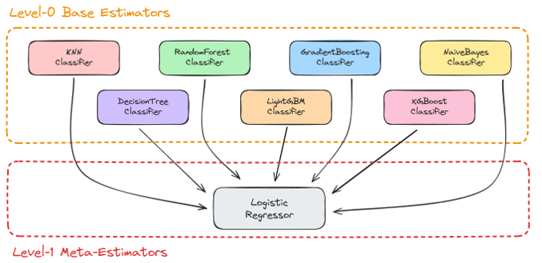
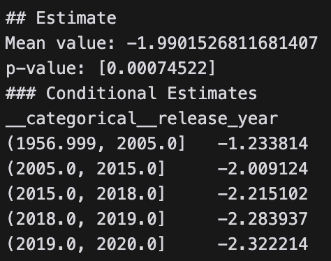

# Enterprise Data Science and ML in Production - INSY 695 - Group Project

## Team Members

- Arnav Gupta
- Freddy Chen
- Jatin Suri
- Lakshya Agarwal
- Om Sangwan
- Yiyi Yang

## Data Source

The dataset we are using is the [Spotify - 30000 songs](https://www.kaggle.com/datasets/joebeachcapital/30000-spotify-songs).

## Project Description

We aim to uncover patterns and relationships that drive song popularity to empower artists and producers with the knowledge to make smarter, evidence-based decisions. We will be using the Spotify dataset to analyze the features of songs and their popularity. We aim to build two models:

- Predictive Model for Song Popularity
- Causal Model for Song's Duration Effect on its Popularity

## Model 1: Predictive Model for Song Popularity

## Model 2: Causal Model for Song's Duration Effect on Song's Popularity

The results show a statistically significant negative causal relationship between the duration of a song and its popularity that increases with time.
